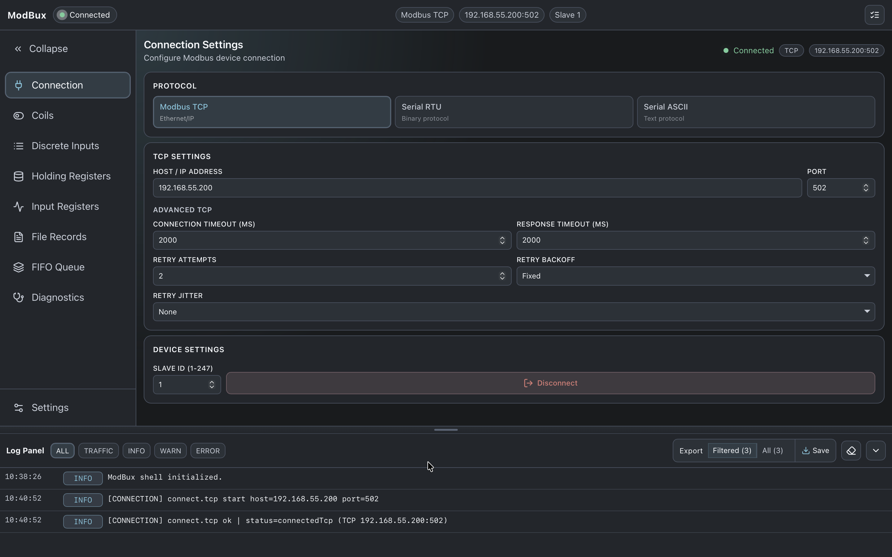
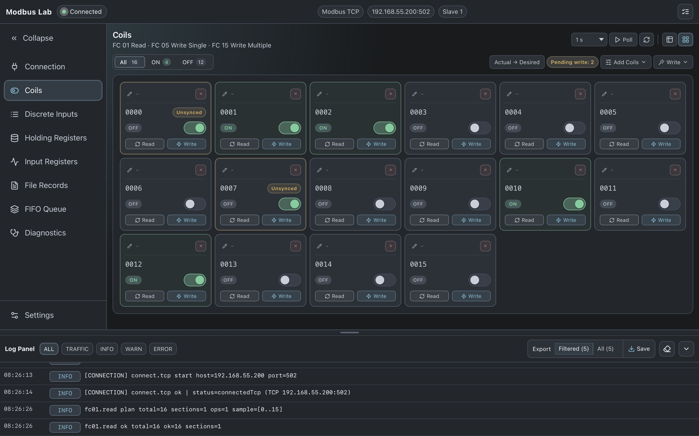
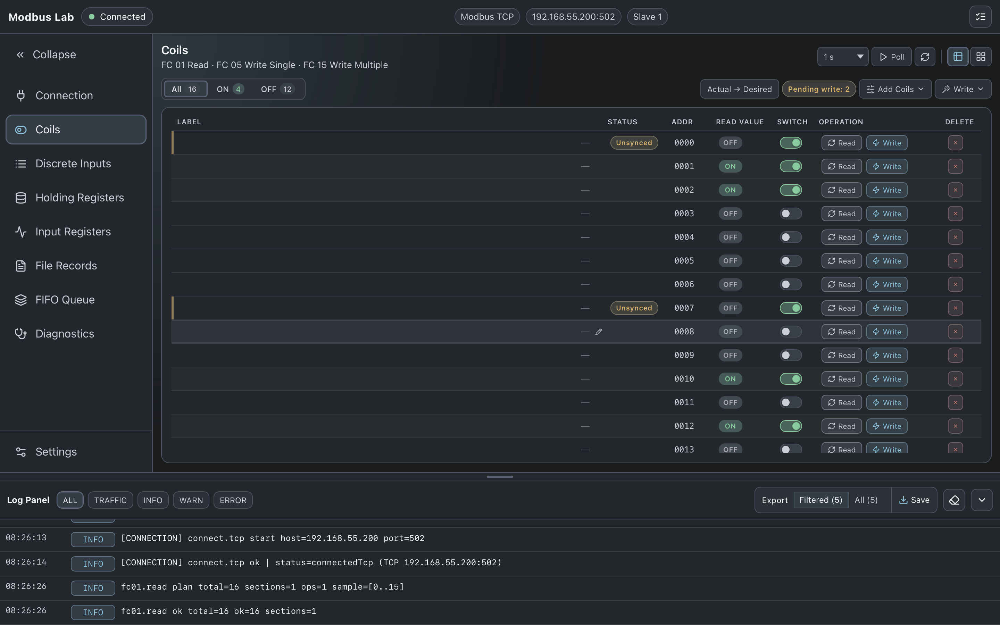
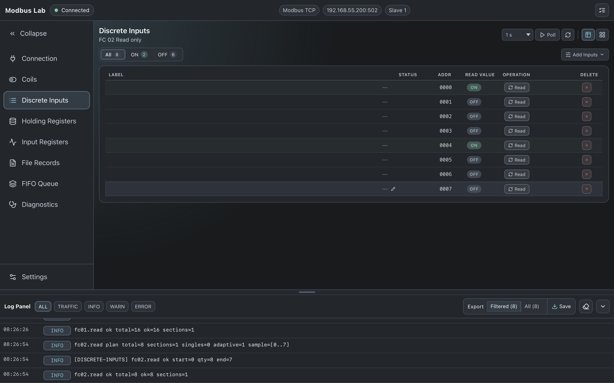
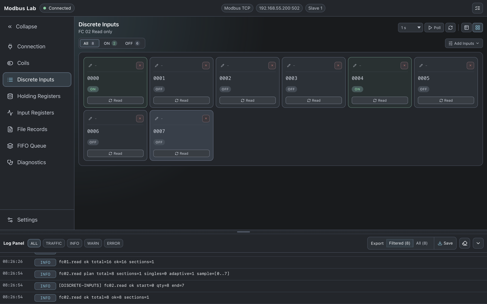
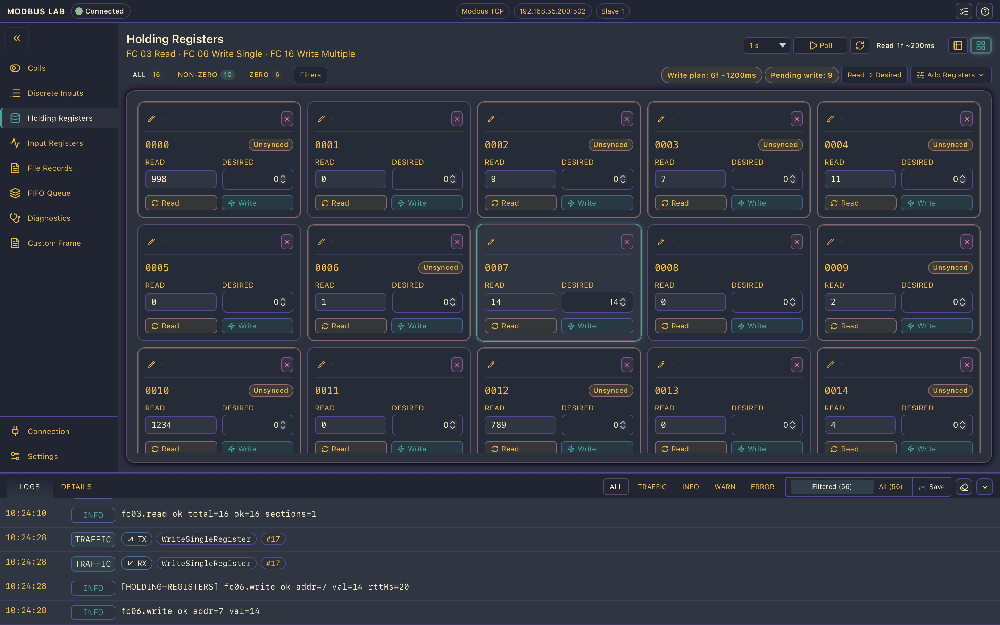
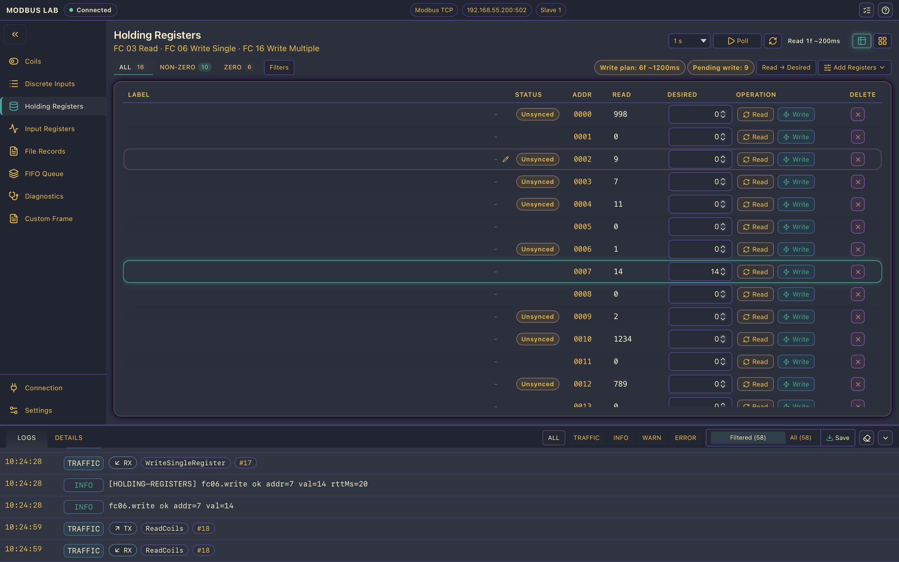
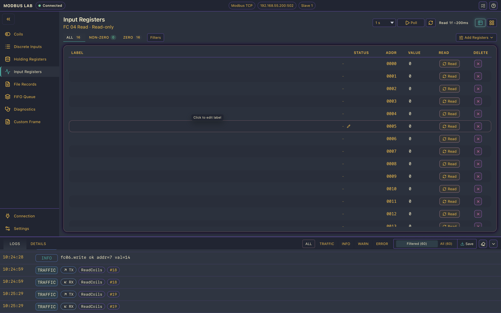

# Modbus Lab

**Modbus Lab** is a fast, practical desktop Modbus master client built with Svelte 5 and Tauri v2. 

This tool is powered by the **[modbus-rs](https://github.com/Raghava-Ch/modbus-rs)** stack, a modern Rust implementation designed for:

- embedded (no_std) systems
- deterministic behavior
- cross-platform use (desktop, RTOS, Baremetal, Linux)

This application serves as a real-world validation of the stack.

Designed for day-to-day Modbus operations, it features a highly responsive UI, rich polling controls, and detailed operation logs.

---

## 🚀 Project Status: Alpha

The application is currently in **alpha**. It is fully usable for core Modbus TCP workflows, with active, ongoing development to expand protocol support and features.

### Currently Implemented
* **Connection Management:** Modbus TCP UI with a protocol selector shell prepared for RTU/ASCII.
* **Coils:** Read (FC01), Single Write (FC05), Batch Write (FC15).
* **Discrete Inputs:** Read (FC02).
* **Holding Registers:** Read (FC03), Single Write (FC06), Batch Write (FC16).
* **Input Registers:** Read (FC04).
* **Global Settings:** Configurable poll defaults, display formats, layout forcing, and log preferences.
* **App Logging:** Dedicated log panel with filtering capabilities and native save-to-file export.

### Planned Features (Placeholders)
* File Records (FC20/FC21)
* FIFO Queue (FC24)
* Diagnostics (FC08)

---

## 📡 Protocol Support

| Protocol | Status |
|---------|--------|
| Modbus TCP | ✅ Implemented |
| Modbus RTU | ✅ Implemented |
| Modbus ASCII | ✅ Implemented |

## ✨ Feature Summary

### 🔌 Connection
* Dedicated connection page featuring protocol cards and detailed TCP settings.
* Persistent connected/disconnected state badges in the global header.
* Device context chips displaying protocol, endpoint, and slave ID at a glance.

### 🟢 Coils & Discrete Inputs (FC01, FC02, FC05, FC15)
* **Flexible Views:** Toggle between dense table views and interactive switch-card views.
* **Operations:** Support for single read/write actions and pending batch writes for desired values.
* **Polling:** Granular polling controls with interval adjustments and limits.
* **Addressing:** Add custom address ranges or single custom addresses on the fly.

### 🔢 Registers (FC03, FC04, FC06, FC16)
* **Flexible Views:** Table and card views for both Input and Holding registers.
* **Smart Editing:** Compare "Read Value" versus "Desired Value" before committing writes.
* **Advanced Filtering:** Include/exclude specific addresses via ranges or lists.
* **Intelligent Polling:** Practical interval handling with chunked section planning for Input Registers.

### 📝 Logging & Settings
* **Live Traffic Logs:** Filter by `ALL`, `INFO`, `WARN`, and `ERROR`.
* **Plan Logs:** Scheduling and plan logs for grouped read/write operations.
* **Native Export:** Save logs directly to your local filesystem via a native desktop dialog.
* **Customization:** Tailor the experience with display formats (Decimal/Hex), log time precision, forced UI layouts (Auto/Vertical/Horizontal), and per-feature default limits.

---

## 📸 Demo Screenshots

### Connection


### Coils



### Discrete Inputs



### Holding Registers



### Input Registers


## Log Examples

This helps debugging real-world Modbus communication issues.

```text
INFO  Modbus Lab shell initialized.
INFO  [CONNECTION] connect.tcp start host=192.168.55.200 port=502
INFO  [CONNECTION] connect.tcp ok | status=connectedTcp (TCP 192.168.55.200:502)
INFO  fc01.read plan total=16 sections=1 ops=1 sample=[0..15]
INFO  fc01.read ok total=16 ok=16 sections=1
INFO  fc03.read plan total=16 sections=1 ops=1 chunkMax=125 sample=[0..15]
INFO  fc03.read ok total=16 ok=16 sections=1
ERROR fc04.read err addr=15 msg=Read input registers failed.
```

## 🛠 Tech Stack

This project bridges a cutting-edge web frontend with a high-performance native backend:

* **Modbus Engine:** [`modbus-rs`](https://github.com/Raghava-Ch/modbus-rs) (Custom Rust implementation)
* **Desktop Runtime:** Tauri v2
* **Frontend:** Svelte 5 + TypeScript + Vite
* **Tooling:** Tauri icon/bundle pipeline

---

## 🎯 Who is this for?

- Industrial automation engineers
- Embedded developers working with Modbus devices
- PLC / SCADA developers
- Anyone testing or debugging Modbus TCP devices

## 📦 Installation

### Download

Download the latest release from:
👉 https://github.com/Raghava-Ch/modbus-lab/releases

It is recommended to build from source yourself. See the [Local Development](#-local-development) section below for instructions.   

### Run

- Launch the application
- Enter Modbus TCP host and port
- Start reading/writing registers

## ⚡ Quick Start

1. Open the app
2. Navigate to the **Connection** page
3. Enter:
   - Host: `192.168.x.x`
   - Port: `502`
4. Connect
5. Go to **Holding Registers**
6. Read address range (e.g., 0–10)

## 💻 Local Development

### Prerequisites
* Node.js 20+
* Rust toolchain + Cargo
* [Tauri v2 Prerequisites](https://v2.tauri.app/start/prerequisites/) for your specific OS (Windows, macOS, or Linux).
```

### Run web dev server
```bash
npm run dev
```

## ⚠ Limitations

- Advanced functions (file record, FIFO) are placeholders, planned for future releases.

Note: This tool is intended as both a **daily-use Modbus client** and a **reference implementation** for modbus-rs.

### Run desktop app (Tauri)
```bash
npm run tauri dev
```

### Type check
```bash
npm run check
```

### Production build
```bash
npm run tauri build
```

## 📄 License

This project is dual-licensed:

- Will always be **GPL v3** for open-source use 

For contributing, see the [Contributing](CONTRIBUTING.md) guidelines.


## Contact

**Name:** Raghava Ch  
**Email:** [ch.raghava44@gmail.com](mailto:ch.raghava44@gmail.com)  
