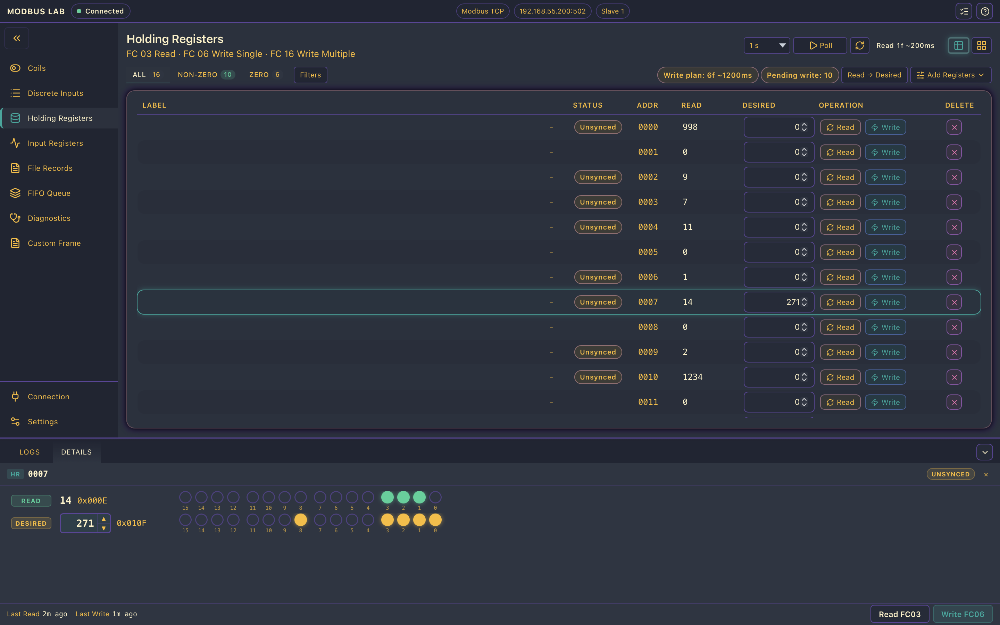

# Modbus Lab

**Modbus Lab** is a professional-grade desktop Modbus master client purpose-built for industrial automation engineers and system integrators. It demonstrates a modern, production-ready approach to Modbus protocol operations using a cutting-edge technology stack.

## 🏭 Industrial Use Case

This application showcases an enterprise-grade architecture for factory floor operations, IoT device management, and SCADA system testing:

- **Built on [modbus-rs](https://github.com/Raghava-Ch/modbus-rs)**: A deterministic, embedded-grade Rust implementation validated for both desktop and embedded (no_std, RTOS, Baremetal, Linux) deployments. [View the modbus-rs project →](https://github.com/Raghava-Ch/modbus-rs)
- **Svelte 5 + TypeScript Frontend**: Delivers a responsive, accessible user interface optimized for technical workflows
- **Tauri v2 Runtime**: Provides secure, native desktop integration with minimal resource footprint across Windows, macOS, and Linux

Designed for engineering teams managing Modbus TCP, RTU, and ASCII deployments, it combines reliability with practical daily-use tooling: responsive UI, granular polling controls, comprehensive operation logs, and native filesystem integration for audit trails.

---

## 🚀 Project Status: Alpha

The application is currently in **alpha**. It is fully usable for core Modbus TCP and Serial (RTU/ASCII) workflows, with active, ongoing development to expand advanced features.

### Currently Implemented
* **Connection Management:** Modbus TCP, Serial RTU, and Serial ASCII connect/disconnect with backend status sync.
* **Coils:** Read (FC01), Single Write (FC05), Batch Write (FC15).
* **Discrete Inputs:** Read (FC02).
* **Holding Registers:** Read (FC03), Single Write (FC06), Batch Write (FC16).
* **Input Registers:** Read (FC04).
* **Diagnostics:** FC07, FC08, FC11, FC12, FC17, FC43 (with protocol-specific constraints surfaced in UI).
* **Custom Frame Tooling:** Raw Modbus PDU builder with function+payload and raw-bytes modes.
* **Global Settings:** Configurable poll defaults, TCP heartbeat behavior, display formats, layout forcing, and log preferences.
* **App Logging:** Dedicated log panel with filtering capabilities and native save-to-file export.

### Planned Features (Placeholders)
* File Records (FC20/FC21)
* FIFO Queue (FC24)

---

## 📡 Protocol Support

| Protocol | Status |
|---------|--------|
| Modbus TCP | ✅ Implemented |
| Modbus RTU | ✅ Implemented |
| Modbus ASCII | ✅ Implemented |

## ✨ Feature Summary

### 🔌 Connection
* Dedicated connection page featuring protocol cards plus detailed TCP and serial settings.
* Persistent connected/disconnected state badges in the global header.
* Device context chips displaying protocol, endpoint, and slave ID at a glance.
* Configurable TCP heartbeat checks to detect idle server outages faster (or disable heartbeat checks). TCP-only.

### 🟢 Coils & Discrete Inputs (FC01, FC02, FC05, FC15)
* **Flexible Views:** Toggle between dense table views and interactive switch-card views.
* **Operations:** Support for single read/write actions and pending batch writes for desired values.
* **Polling:** Granular polling controls with interval adjustments and limits.
* **Addressing:** Add custom address ranges or single custom addresses on the fly.

### 🔢 Registers (FC03, FC04, FC06, FC16)
* **Flexible Views:** Table and card views for both Input and Holding registers.
* **Smart Editing:** Compare "Read Value" versus "Desired Value" before committing writes.
* **Advanced Filtering:** Include/exclude specific addresses via ranges or lists.
* **Intelligent Polling:** Practical interval handling with chunked section planning for Input Registers.

### 📝 Logging & Settings
* **Live Traffic Logs:** Filter by `ALL`, `INFO`, `WARN`, and `ERROR`.
* **Plan Logs:** Scheduling and plan logs for grouped read/write operations.
* **Native Export:** Save logs directly to your local filesystem via a native desktop dialog.
* **Customization:** Tailor the experience with display formats (Decimal/Hex), log time precision, forced UI layouts (Auto/Vertical/Horizontal), TCP heartbeat timing, and per-feature default limits.

### 🧪 Diagnostics & Raw Frames
* **Diagnostics Suite:** Run FC07/08/11/12/17/43 workflows directly from the Diagnostics page.
* **Custom Frame Builder:** Craft and send raw function+payload or full-byte requests for low-level testing.

---

## 📸 Demo Screenshots

### Connection


### Coils


### Holding Registers


### Bitwise Register View


### Discrete Inputs


### Input Registers


## Log Examples

This helps debugging real-world Modbus communication issues.

```text
INFO  Modbus Lab shell initialized.
INFO  [CONNECTION] connect.tcp start host=192.168.55.200 port=502
INFO  [CONNECTION] connect.tcp ok | status=connectedTcp (TCP 192.168.55.200:502)
INFO  fc01.read plan total=16 sections=1 ops=1 sample=[0..15]
INFO  fc01.read ok total=16 ok=16 sections=1
INFO  fc03.read plan total=16 sections=1 ops=1 chunkMax=125 sample=[0..15]
INFO  fc03.read ok total=16 ok=16 sections=1
ERROR fc04.read err addr=15 msg=Read input registers failed.
```

## 🛠 Tech Stack

This project bridges a cutting-edge web frontend with a high-performance native backend:

* **Modbus Engine:** [`modbus-rs`](https://github.com/Raghava-Ch/modbus-rs) (Custom Rust implementation)
* **Desktop Runtime:** Tauri v2
* **Frontend:** Svelte 5 + TypeScript + Vite
* **Tooling:** Tauri icon/bundle pipeline

---

## 🎯 Who is this for?

- Industrial automation engineers
- Embedded developers working with Modbus devices
- PLC / SCADA developers
- Anyone testing or debugging Modbus TCP/RTU/ASCII devices

## 📦 Installation

### Download

Download the latest release from:
👉 https://github.com/Raghava-Ch/modbus-lab/releases

It is recommended to build from source yourself. See the [Local Development](#-local-development) section below for instructions.   

### Run

- Launch the application
- Choose protocol (TCP / Serial RTU / Serial ASCII)
- Enter endpoint details (TCP host/port or serial port settings)
- Start reading/writing registers

## ⚡ Quick Start

1. Open the app
2. Navigate to the **Connection** page
3. Enter:
   - Host: `192.168.x.x`
   - Port: `502`
4. Connect
5. Go to **Holding Registers**
6. Read address range (e.g., 0–10)

## 💻 Local Development

### Prerequisites
* Node.js 20+
* Rust toolchain + Cargo
* [Tauri v2 Prerequisites](https://v2.tauri.app/start/prerequisites/) for your specific OS (Windows, macOS, or Linux).

### Workspace layout
* `apps/client` contains the current Modbus client desktop application.
* `apps/server` contains an early server simulator sample app used to validate shared frontend assets and styles.
* `packages/shared-frontend` contains shared frontend assets and base styles.

### Run client web dev server
```bash
npm run dev:client
```

### Run server sample web dev server
```bash
npm run dev:server
```

## ⚠ Limitations

- TCP heartbeat/reconnect supervision is TCP-only.
- Diagnostics UI intentionally enforces serial-only for functions traditionally defined for serial line devices.
- Advanced functions (file record, FIFO) are placeholders, planned for future releases.

Note: This tool is intended as both a **daily-use industrial Modbus client** and a **reference implementation** for modbus-rs.

### Run client desktop app (Tauri)
```bash
npm run tauri:client -- dev
```

### Type check
```bash
npm run check
```

### Client production build
```bash
npm run tauri:client -- build
```

## 📄 License

This project is dual-licensed:

- Will always be **GPL v3** for open-source use 

For contributing, see the [Contributing](CONTRIBUTING.md) guidelines.


## Contact

**Name:** Raghava Ch  
**Email:** [ch.raghava44@gmail.com](mailto:ch.raghava44@gmail.com)  
