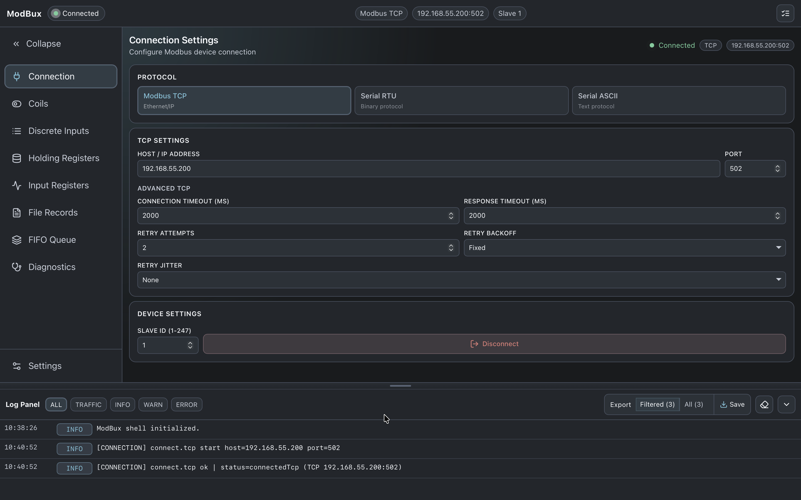
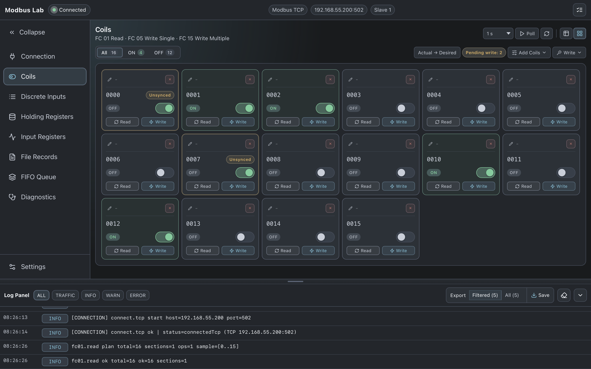
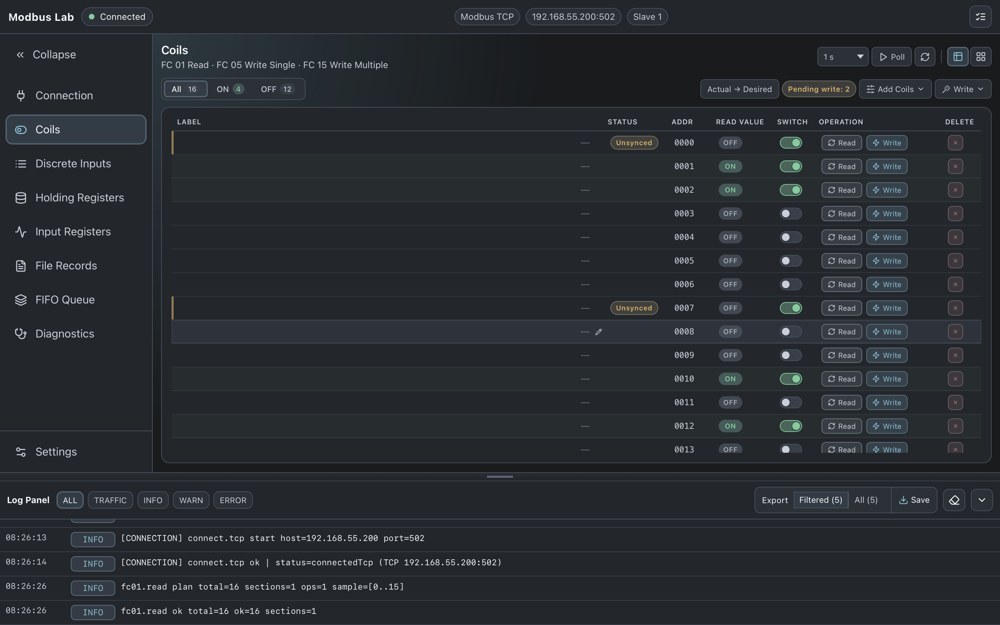
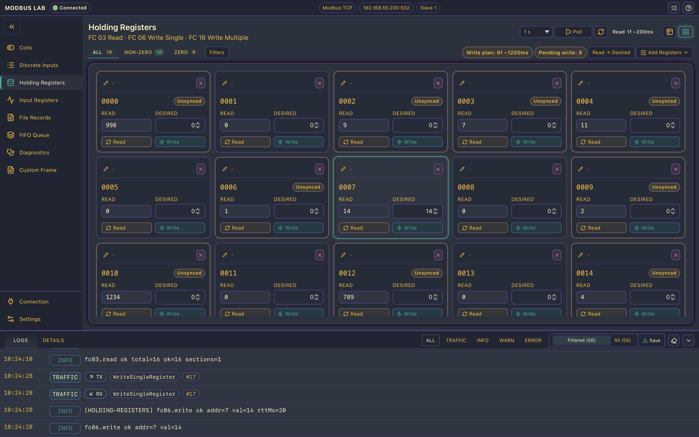
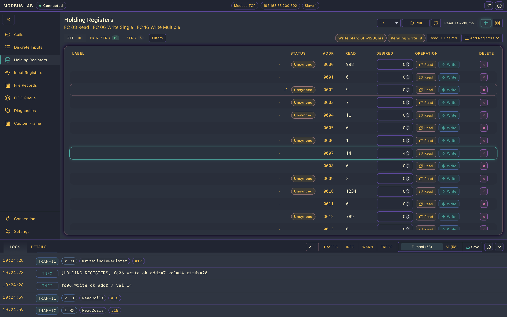
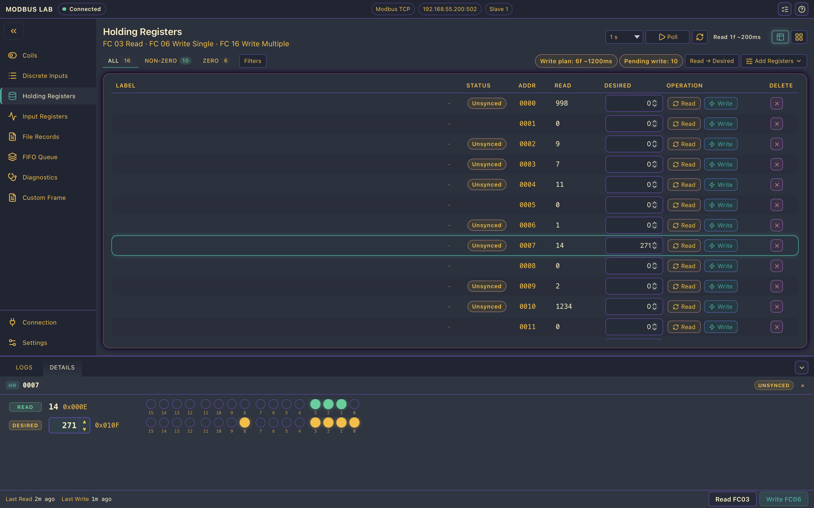
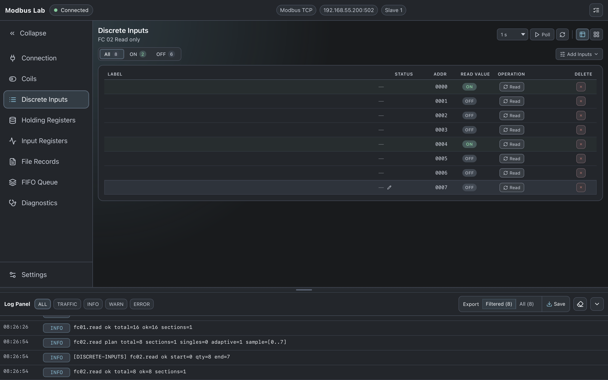
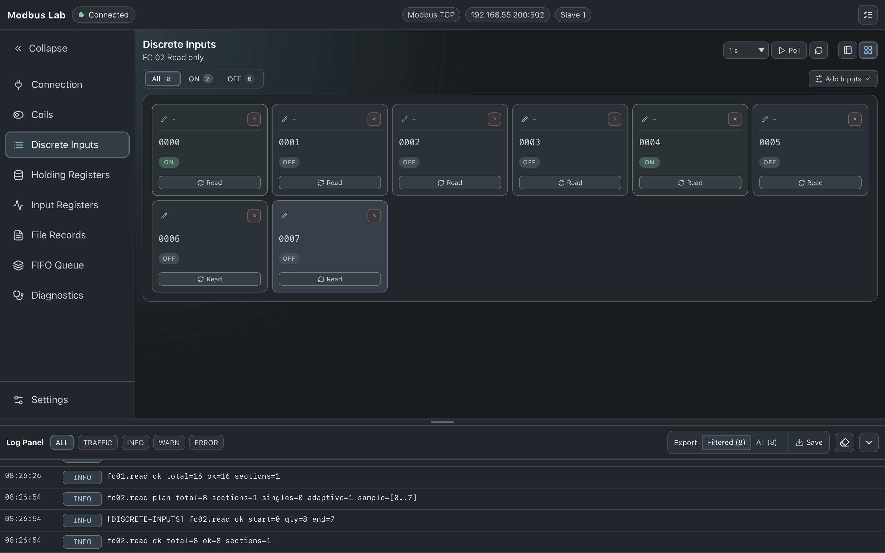
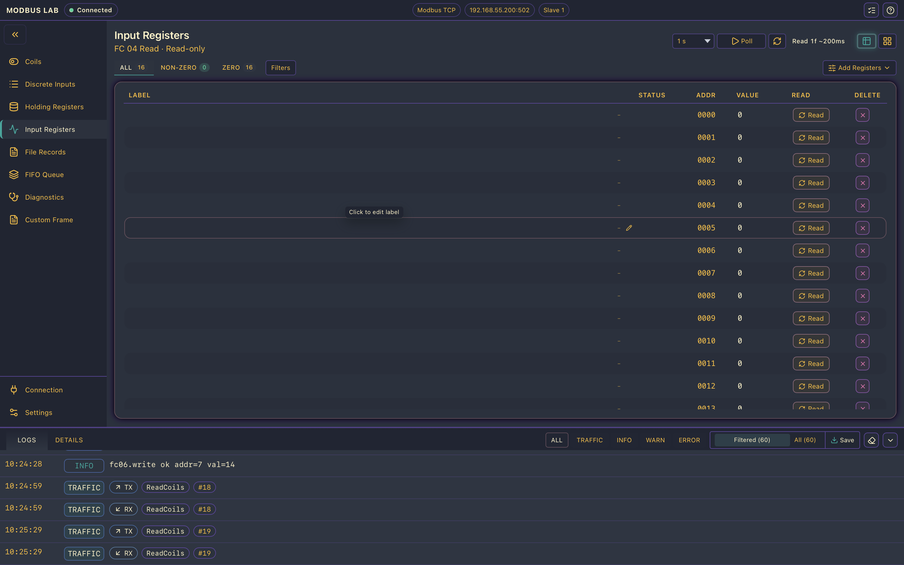

# Modbus Lab

**Modbus Lab** is a professional-grade desktop Modbus toolkit purpose-built for industrial automation engineers and system integrators. It ships two Tauri desktop applications — a **client** (Modbus master) and a **server** (Modbus slave simulator) — that together cover the full test-and-commissioning workflow for Modbus TCP, RTU, and ASCII devices.

## 🏭 Industrial Use Case

- **Built on [modbus-rs](https://github.com/Raghava-Ch/modbus-rs)**: A deterministic, embedded-grade Rust implementation validated for both desktop and embedded (no_std, RTOS, Baremetal, Linux) deployments. [View the modbus-rs project →](https://github.com/Raghava-Ch/modbus-rs)
- **Svelte 5 + TypeScript Frontend**: Delivers a responsive, accessible user interface optimized for technical workflows
- **Tauri v2 Runtime**: Secure, native desktop integration with minimal resource footprint across Windows, macOS, and Linux

Designed for engineering teams managing Modbus TCP, RTU, and ASCII deployments, it combines reliability with practical daily-use tooling: responsive UI, granular polling controls, comprehensive operation logs, native filesystem integration for audit trails, and optional iBus v1.1 self-description support.

---

## 🚀 Project Status: Alpha

The application is currently in **alpha**. It is fully usable for core Modbus TCP and Serial (RTU/ASCII) workflows, with active, ongoing development to expand advanced features.

### Implemented Features

**Client app (Modbus master)**
* **Connection Management:** Modbus TCP, Serial RTU, and Serial ASCII connect/disconnect with backend status sync.
* **Coils:** Read (FC01), Single Write (FC05), Batch Write (FC15).
* **Discrete Inputs:** Read (FC02).
* **Holding Registers:** Read (FC03), Single Write (FC06), Batch Write (FC16).
* **Input Registers:** Read (FC04).
* **FIFO Queue (FC24):** Per-address queue management, polling, and export.
* **File Records (FC20/FC21):** Segment-based read/write with scenario save and load.
* **Diagnostics:** FC07, FC08, FC11, FC12, FC17, FC43 (with protocol-specific constraints surfaced in UI).
* **Custom Frame Tooling:** Raw Modbus PDU builder with function+payload and raw-bytes modes.
* **Cloud Bridge (MQTT):** Forward Modbus values to/from an MQTT broker. Per-mapping direction (Publish / Subscribe / Bidirectional), QoS, retain, and templated topics (`{client_id}`, `{area}`, `{address}`, `{name}`).
* **iBus v1.1 Discovery:** Probe a connected slave, read its full point descriptor table, and decode engineering values automatically. See [iBus](#-ibus-v11--self-describing-modbus-devices) below.
* **Global Settings:** Configurable poll defaults, TCP heartbeat behavior, display formats, layout forcing, and log preferences.
* **App Logging:** Dedicated log panel with filtering and native save-to-file export.

**Server app (Modbus slave simulator)**
* **Modbus Listener:** Accept TCP and Serial connections; serve FC01–FC04, FC05/FC06/FC15/FC16 requests from any Modbus master.
* **Register Pages:** Live Coil, Discrete Input, Holding Register, and Input Register views with value editing and polling.
* **FIFO Snapshot Engine:** Snapshot-link rules that push register values into FIFO queues on change or on a timer.
* **File Records (FC20/FC21):** Segment management matching the client's scenario format.
* **Traffic Page:** Real-time protocol traffic log filtered to `traffic`-level events.
* **iBus v1.1 Publishing:** Publish a fully-formed iBus descriptor (identity, manifest, point table) into the reserved HR 9000–9999 region for any client to auto-discover. See [iBus](#-ibus-v11--self-describing-modbus-devices) below.
* **Diagnostics:** FC07, FC08, FC11, FC12, FC17, FC43 server-side tooling.

---

## 📡 Protocol Support

| Protocol | Status |
|---------|--------|
| Modbus TCP | ✅ Implemented |
| Modbus RTU | ✅ Implemented |
| Modbus ASCII | ✅ Implemented |

## ✨ Feature Summary

### 🔌 Connection
* Dedicated connection page featuring protocol cards plus detailed TCP and serial settings.
* Persistent connected/disconnected state badges in the global header.
* Device context chips displaying protocol, endpoint, and slave ID at a glance.
* Configurable TCP heartbeat checks to detect idle server outages faster (or disable heartbeat checks). TCP-only.

### 🟢 Coils & Discrete Inputs (FC01, FC02, FC05, FC15)
* **Flexible Views:** Toggle between dense table views and interactive switch-card views.
* **Operations:** Support for single read/write actions and pending batch writes for desired values.
* **Polling:** Granular polling controls with interval adjustments and limits.
* **Addressing:** Add custom address ranges or single custom addresses on the fly.

### 🔢 Registers (FC03, FC04, FC06, FC16)
* **Flexible Views:** Table and card views for both Input and Holding registers.
* **Smart Editing:** Compare "Read Value" versus "Desired Value" before committing writes.
* **Advanced Filtering:** Include/exclude specific addresses via ranges or lists.
* **Intelligent Polling:** Practical interval handling with chunked section planning for Input Registers.

### � FIFO Queue (FC24)
* **Client:** Track per-address FIFO queues, poll on an interval, and export queue snapshots.
* **Server:** Define snapshot-link rules to push holding/input register values into FIFO queues on value-change or on a configurable timer trigger.

### 📁 File Records (FC20/FC21)
* **Segment-based read/write** with per-segment file number, record number, and byte length configuration.
* **Scenario save/load:** Export and import named scenarios as JSON files for repeatable test runs.

### ☁️ Cloud Bridge (MQTT)  _(client only)_
* Connect to any MQTT broker and forward Modbus values bidirectionally.
* Per-mapping direction: **Publish**, **Subscribe**, or **Bidirectional**.
* Configurable QoS, retain flag, and templated topics using `{client_id}`, `{area}`, `{address}`, `{name}`.
* Live bridge log panel alongside the main app log.

### 📡 Modbus Listener / Server Mode  _(server app only)_
* Accept inbound TCP and Serial connections and respond to FC01–FC04, FC05/FC06/FC15/FC16 function codes.
* **Traffic page:** Real-time protocol event stream at `traffic` log level.
* Per-register rule engine: cycle, sine, sawtooth, and triangle waveform generators for simulation.

### 🔬 iBus v1.1 — Self-describing Modbus Devices
iBus is an open, royalty-free overlay on standard Modbus that gives any device BACnet-style self-description with no new function codes.  
Learn more: **[ibusnetwork.org →](https://www.ibusnetwork.org)**

* **Server — Publish:** Enable iBus in `Settings → Protocols`. The server publishes a fully-formed descriptor (signature, identity block, manifest, point descriptor table) into the reserved **HR 9000–9999** region.
  - **Live mode:** The descriptor is derived automatically from whatever registers are loaded on the Coils, Discrete Inputs, Holding Register, and Input Register pages.
  - **Manual mode:** Define or import a descriptor JSON directly on the iBus page with overflow auto-fit.
  - **Reserved-range protection:** Adding registers inside HR 9000–9999 is blocked in iBus mode (notification + log).
* **Client — Discover:** Probe any connected slave for iBus support; on success, read the full point descriptor table and decode engineering values (scaled numbers, booleans, text) automatically. Optionally seed the register pages from the discovered point list.
* **Conformance checks:** The client runs the full iBus conformance suite (signature, version, identity, manifest, point table, unused-range) and reports a pass/fail with per-check detail.
* **Shared core:** The on-the-wire byte layout is byte-exact with the C/Python reference implementations and lives in `crates/ibus-core/`.

### �📝 Logging & Settings
* **Live Traffic Logs:** Filter by `ALL`, `INFO`, `WARN`, and `ERROR`.
* **Plan Logs:** Scheduling and plan logs for grouped read/write operations.
* **Native Export:** Save logs directly to your local filesystem via a native desktop dialog.
* **Customization:** Tailor the experience with display formats (Decimal/Hex), log time precision, forced UI layouts (Auto/Vertical/Horizontal), TCP heartbeat timing, and per-feature default limits.

### 🧪 Diagnostics & Raw Frames
* **Diagnostics Suite (client + server):** Run FC07/08/11/12/17/43 workflows directly from the Diagnostics page.
* **Custom Frame Builder (client only):** Craft and send raw function+payload or full-byte requests for low-level testing.

---

## 📸 Demo Screenshots

### Connection


### Coils



### Holding Registers



### Bitwise Register View


### Discrete Inputs




### Input Registers


## Log Examples

This helps debugging real-world Modbus communication issues.

```text
INFO  Modbus Lab shell initialized.
INFO  [CONNECTION] connect.tcp start host=192.168.55.200 port=502
INFO  [CONNECTION] connect.tcp ok | status=connectedTcp (TCP 192.168.55.200:502)
INFO  fc01.read plan total=16 sections=1 ops=1 sample=[0..15]
INFO  fc01.read ok total=16 ok=16 sections=1
INFO  fc03.read plan total=16 sections=1 ops=1 chunkMax=125 sample=[0..15]
INFO  fc03.read ok total=16 ok=16 sections=1
ERROR fc04.read err addr=15 msg=Read input registers failed.
```

## 🛠 Tech Stack

This project bridges a cutting-edge web frontend with a high-performance native backend:

* **Modbus Engine:** [`modbus-rs`](https://github.com/Raghava-Ch/modbus-rs) (Custom Rust implementation)
* **Desktop Runtime:** Tauri v2
* **Frontend:** Svelte 5 + TypeScript + Vite
* **Tooling:** Tauri icon/bundle pipeline

---

## 🎯 Who is this for?

- Industrial automation engineers
- Embedded developers working with Modbus devices
- PLC / SCADA developers
- Anyone testing or debugging Modbus TCP/RTU/ASCII devices

## 📦 Installation

### Download

Download the latest release from:
👉 https://github.com/Raghava-Ch/modbus-lab/releases

It is recommended to build from source yourself. See the [Local Development](#-local-development) section below for instructions.   

### Run

- Launch the application
- Choose protocol (TCP / Serial RTU / Serial ASCII)
- Enter endpoint details (TCP host/port or serial port settings)
- Start reading/writing registers

## ⚡ Quick Start

1. Open the app
2. Navigate to the **Connection** page
3. Enter:
   - Host: `192.168.x.x`
   - Port: `502`
4. Connect
5. Go to **Holding Registers**
6. Read address range (e.g., 0–10)

## 💻 Local Development

### Prerequisites
* Node.js 20+
* Rust toolchain + Cargo
* [Tauri v2 Prerequisites](https://v2.tauri.app/start/prerequisites/) for your specific OS (Windows, macOS, or Linux).

### Workspace layout
* `apps/client` — Modbus master desktop application (Tauri + Svelte 5).
* `apps/server` — Modbus slave simulator desktop application (Tauri + Svelte 5).
* `packages/shared-frontend` — shared frontend assets and base styles.
* `crates/ibus-core` — shared Rust crate implementing iBus v1.1 codec and conformance.

### Run the desktop applications (recommended)

```bash
# Client (Modbus master)
npm run tauri:client -- dev

# Server (Modbus slave simulator) — in a separate terminal
npm run tauri:server -- dev
```

### Run as web dev servers (UI-only, no Tauri backend)

```bash
# Client web dev server (port 1420)
npm run dev:client

# Server web dev server (port 1421)
npm run dev:server
```

## ⚠ Limitations

- TCP heartbeat/reconnect supervision is TCP-only.
- Diagnostics UI intentionally enforces serial-only for functions traditionally defined for serial line devices.
- Cloud Bridge (MQTT) is available in the client app only.

Note: This tool is intended as both a **daily-use industrial Modbus toolkit** (client + simulator) and a **reference implementation** for modbus-rs [modbus-rs](https://github.com/Raghava-Ch/modbus-rs) and iBus v1.1.

### Run client desktop app (Tauri)
```bash
npm run tauri:client -- dev
```

### Type check
```bash
npm run check
```

### Client production build
```bash
npm run tauri:client -- build
```

## 📄 License

This project is dual-licensed:

- Will always be **GPL v3** for open-source use 

For contributing, see the [Contributing](CONTRIBUTING.md) guidelines.


## Contact

**Name:** Raghava Ch  
**Email:** [ch.raghava44@gmail.com](mailto:ch.raghava44@gmail.com)  
